# WP Blocks
## Section

To add **green text** on the section:

- You can directly change the text in the Block editor by clicking on the text, and then clicking save.
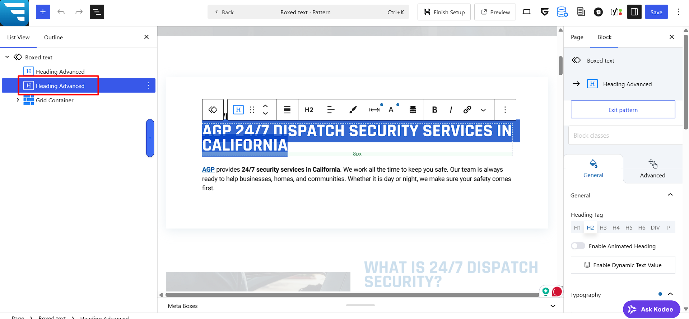

---

## Copying Blocks

Follow these steps to copy a block in the page builder:

1. **Select the block column**  
   Click on the section you want to copy, click on the three dots, and then select 'Copy'.
   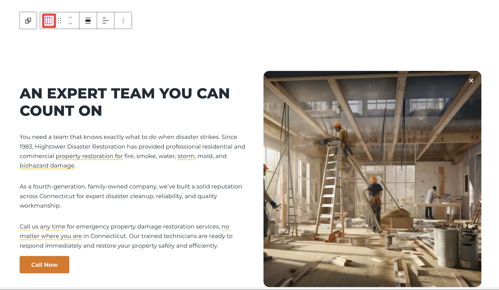

2. **Copy the block**  
   Click the **three dots** on the block toolbar and select **Copy**.  
   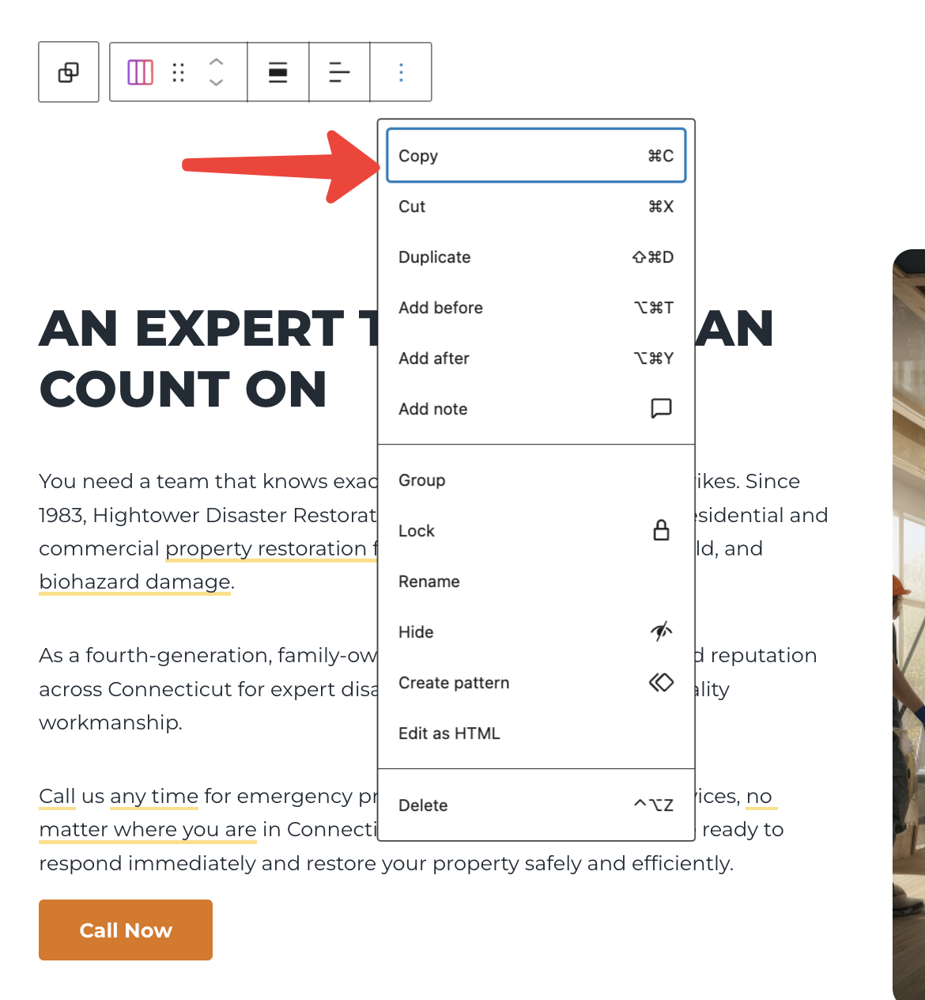

3. **Also, you can copy the block from side bar panel**  
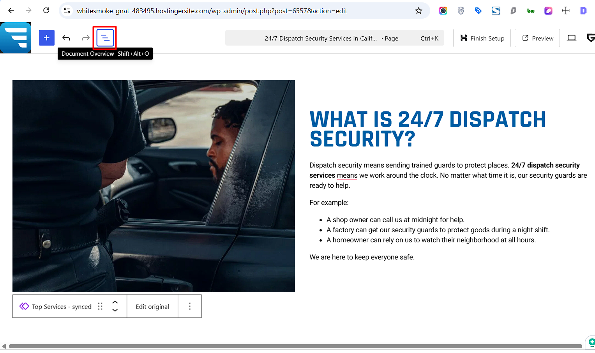

4. **Click on the three dots and click on the 'Copy'**  
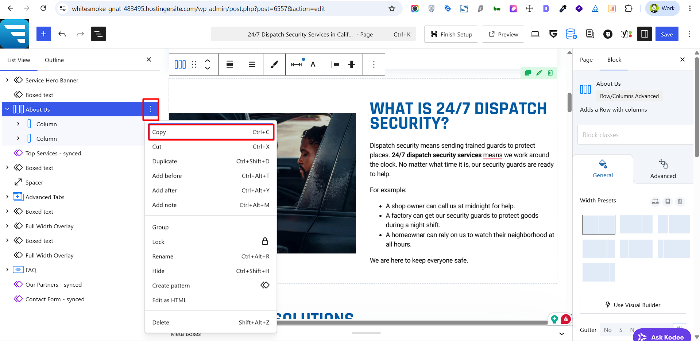

6. **Paste the block on a new page**  
   - Open the page where you want to paste the block.  
   - Press:
     - **Command + V** on Mac  
     - **Ctrl + V** on Windows

7. **Also, in the side bar you can there are some showing pink blocks.** Those are reusable templates. You can also copy those blocks if you want to use them in other pages.
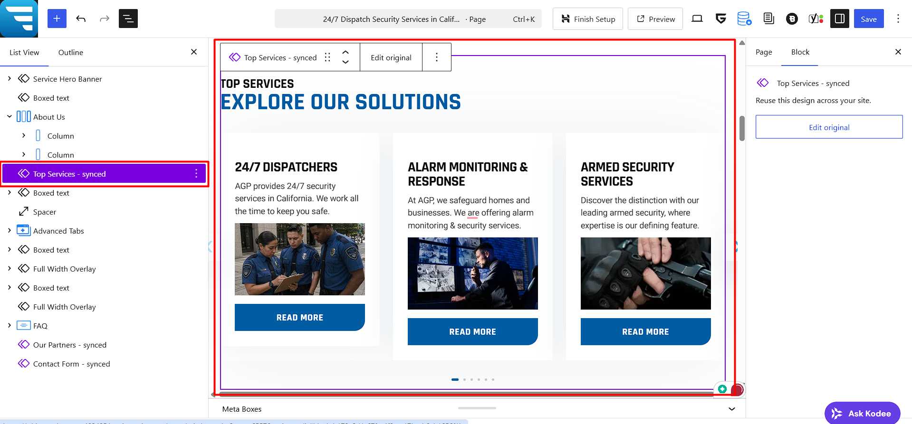

8. **To use a reusable template, click on the 'Add Block' button and select 'Reusable Templates'.**  
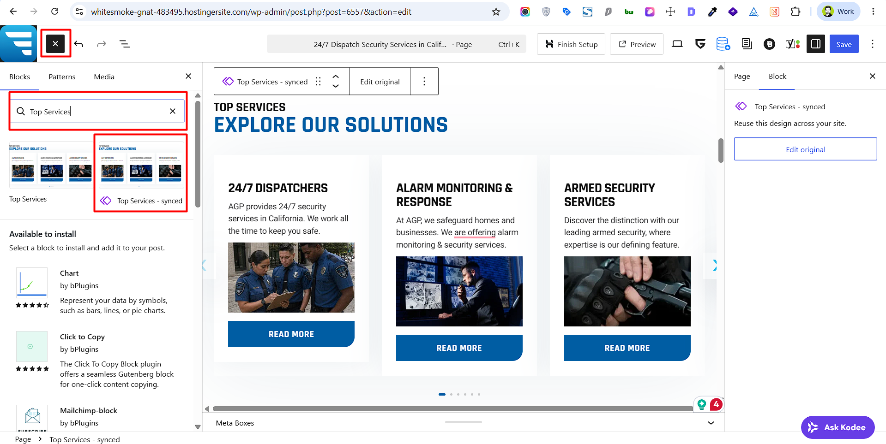

---

## Reusable Templates (Synced Pattern)

Follow these steps to update a reusable templates: Those are the global sections that are used in multiple pages. If you change it here, it will change in all the pages where it is used.

1. **Go to Reusable Templates**  
   Click on the **Reusable Templates** in the left sidebar. 
   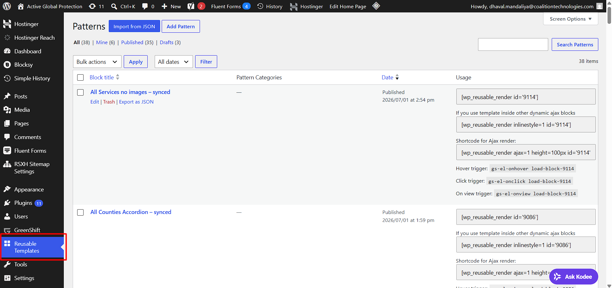

2. **Edit the reusable template**  
   Click on **'Edit'** button of the reusable template you want to update.  
   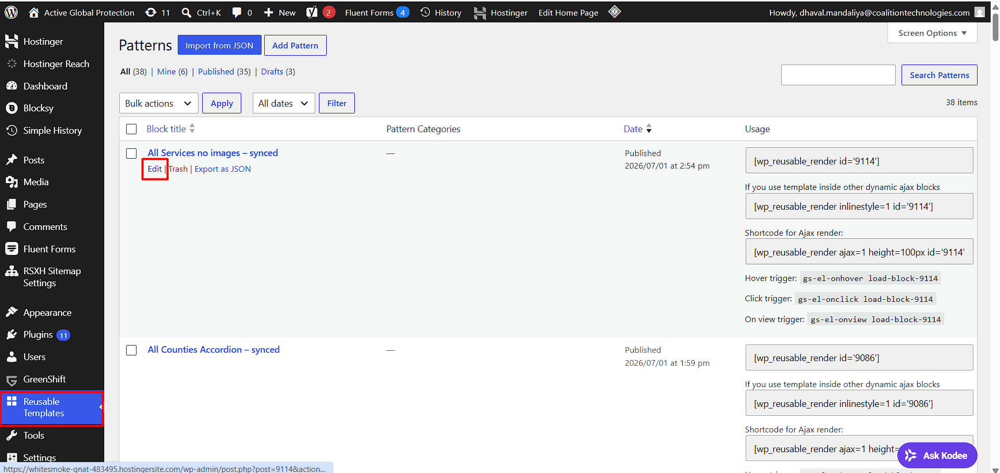

3. **Click on the text you want to update.**    
   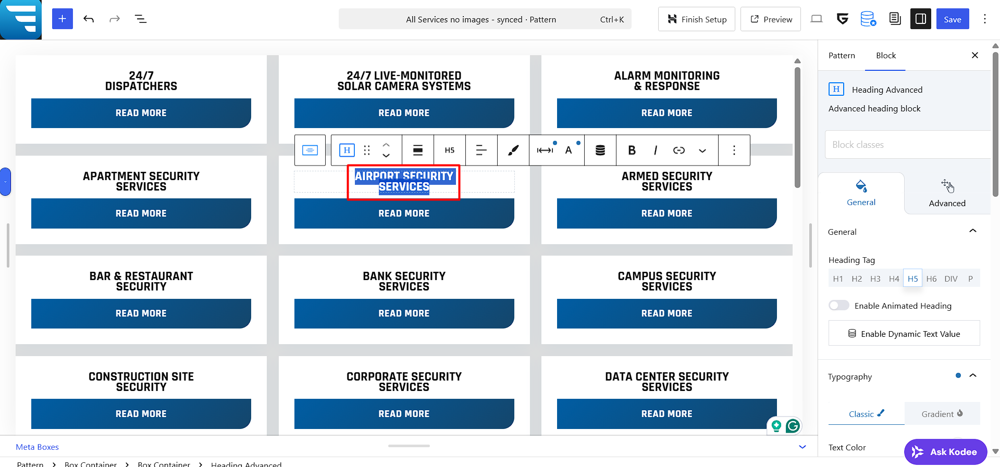

4. **Click on the 'Save' button to save the changes.**    
   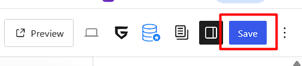
     
---

## Useful Article

Please refer to these articles for more information:

1. <a href="https://creativethemes.com/blocksy/docs/" target="_blank">Blocksy Documentation</a>

2. <a href="https://creativethemes.com/blocksy/docs/general-options/general/" target="_blank">General Options</a>