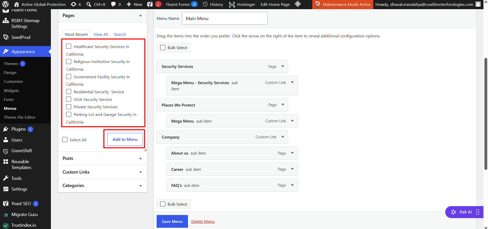
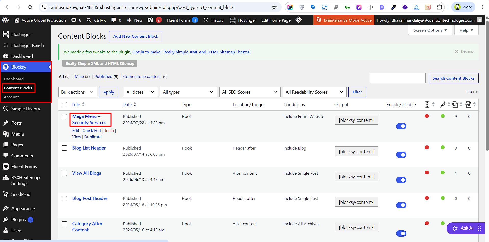
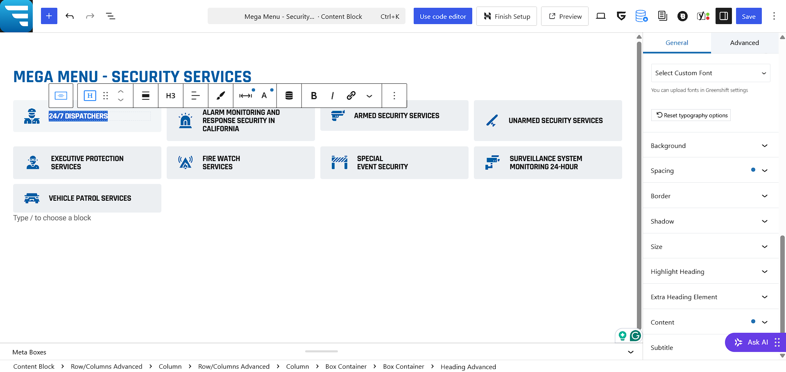
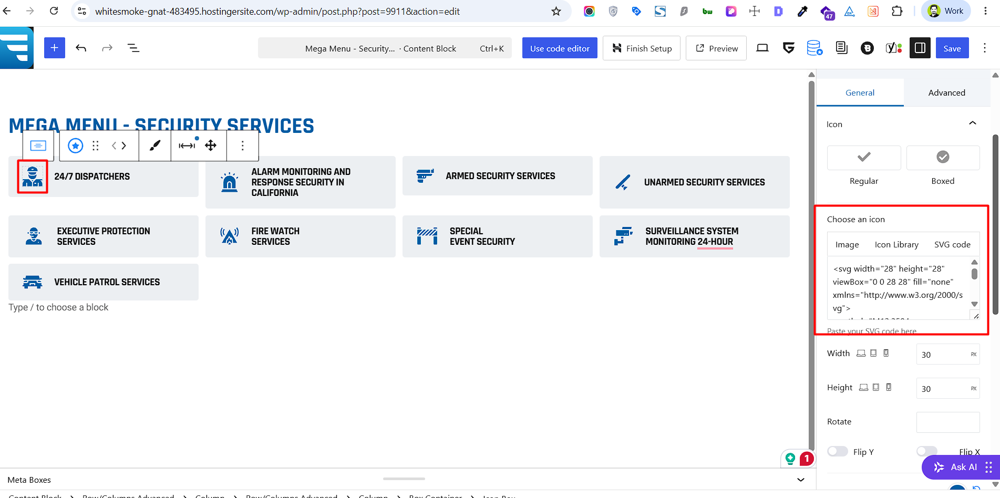
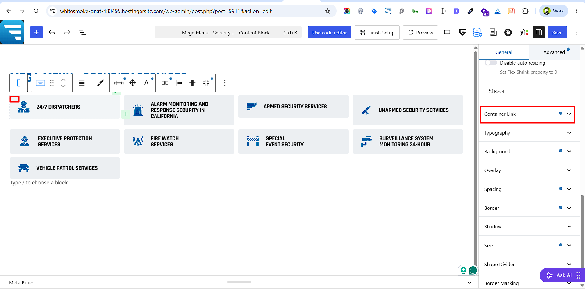
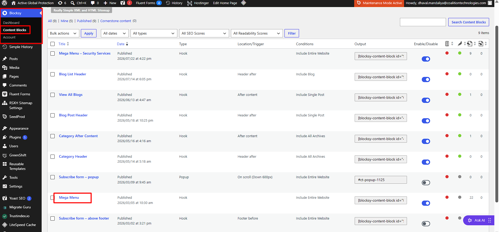

# Menu

## How to Update the 'Company' Menu
1. Go to WP Admin → Appearance → Menus.
2. From the left panel, select items to add (such as Pages, Custom Links, or Categories), and click Add to Menu.
3. Drag and drop the menu items into your preferred hierarchical structure

## How to Update the 'Security Services' Menu
1. Go to WP Admin → Blocksy → Content Blocks → Edit/Click on the 'Mega Menu - Security Services' content block

2. Edit nav title text:
    - Click directly on any item's title (e.g., 24/7 Dispatchers, Armed Security Services) to update the text
    
3. Edit nav item icon:
    - Click on the Icon block
    - Update Icon - In the right-hand sidebar under General → Icon, locate the Choose an icon section
    - Paste custom 'svg' code directly into the Paste your SVG code here box.
    - (Optional) Adjust the Width and Height settings below to resize the icon.
    
4. Edit nav item links:
    - Select the Box Container (the block wrapping the item - click on top left corner) in the List View.
    - In the right-hand sidebar under General → Container Link
    - Paste or type your target page URL into the link input field.
    - Add a descriptive title (e.g., 24/7 Dispatchers) in the Title for SEO input field.
    
5. Click Save Menu. 

## How to Update the 'Places We Protect' Menu
1. Go to WP Admin → Blocksy → Content Blocks → Edit/Click on the 'Mega Menu' content block

2. <strong>Now you can follow the same steps as '<i>[Mega Menu - Security Services](#how-to-update-the-security-services-menu)</i>'</strong>